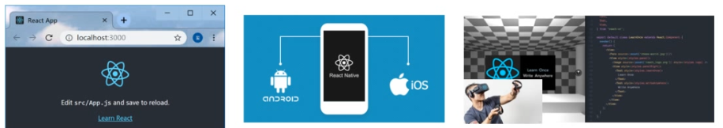

# react概述

+  [ ]   React 介绍
+  [ ]   React 特点
+  [ ]   React 脚手架（CLI）
+  [ ]   React 的基本使用

## react 介绍


**目标**：了解什么是react？

**内容**：

+ react官网
  + react官网(<https://reactjs.org/>)
  + react中文网(https://zh-hans.reactjs.org/)
+ React 是一个用于构建用户界面（UI，对咱们前端来说，简单理解为：HTML 页面）的 JavaScript 库  

+ React 起源于 Facebook 内部项目（News Feed，2011），后又用来架设 `Instagram` 的网站（2012），并于 2013 年 5 月开源[react介绍](https://baike.baidu.com/item/react/18077599?fr=aladdin)  
+ React 是最流行的前端开发框架之一，其他：Vue、Angular 等等[框架对比](https://www.npmtrends.com/)

**总结**

 + react是一个用于构建用户界面的Javascript库

## react特点

**目标**：能够说出react的三个特点。

**内容**：

+ 声明式UI

你只需要描述UI（HTML）看起来是什么样的，就跟写HTML一样。

react中通过数据驱动视图的变化，当数据发生改变react能够高效的更新并渲染DOM。

```js
<div className="app">
    <h1>Hello React! 动态数据变化:{count}</h1>
</div>
```

+ 基于组件

组件是react中*最重要*的内容

组件用于表示页面中的部分内容

组合、复用多个组件，就可以实现完整的页面功能


+ 学习一次，随处使用   

使用react/rect-dom可以开发Web应用

使用react/react-native可以开发移动端原生应用（react-native）RN 

使用react可以开发VR（虚拟现实）应用（react/react360）



**总结**

从你的角度看 React 特点：  

- 工资高、大厂必备（阿里在用）
- 工资高、大厂必备（字节跳动在用）
- 工资高、大厂必备（百度、腾讯、京东、蚂蚁金服、拼多多、美团、外企、银行等都在用）

## react 脚手架的使用

**目标**：掌握如何使用react脚手架创建react项目。 

**内容**

- `create react app`是FaceBook的React团队官方出的一个构建React应用的脚手架工具
- 方式一：
  - 全局安装`npm i -g create-react-app`或者`yarn global add create-react-app`
  - 初始化项目`create-react-app react-basic`，react-basic 表示项目名称，可以修改 
  - 启动项目：`yarn start`or `npm start`
  - 缺点：全局安装命令无法保证命令一直是最新版本。
- 方式二：
  - 命令：`npx create-react-app react-basic`
  - 启动项目：`yarn start`or `npm start`

  - npx是 npm v5.2 版本新添加的命令，用来简化 npm 中工具包的使用
  - 现在：npx 调用最新的 create-react-app 直接创建 React 项目

**总结**

+ `create-react-app`是react官方提供一个脚手架工具，用于创建react项目
+ 通过`npx create-react-app react-basic`命令可以快速创建一个react项目

## react 的基本使用

**目标**：掌握react的基本使用功能步骤

**内容** 

1. 导入`react`和`react-dom`
2. 创建react元素(虚拟DOM)
3. 渲染react元素到页面中

**核心代码**

```jsx
// 导入react和react-dom
import React from 'react'
import ReactDOM from 'react-dom'

// 创建元素
const title = React.createElement('h1', null, 'hello react')

// 渲染react元素
ReactDOM.render(title, document.getElementById('root'))
```

**总结**

1. react脚手架已经安装了react和react-dom的依赖包，不需要额外安装依赖包

**练习**

1. 使用react，生成以下结构 

```jsx
<div id="box" class="demo">这是一个react案例</div>
```

2. 生成结构2

```jsx
<ul class="list">
    <li>香蕉</li>
    <li>橘子</li>
    <li>苹果</li>
</ul>
```
