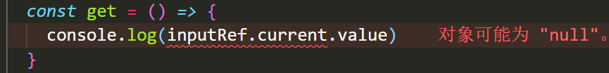
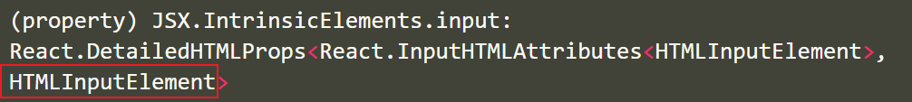

# React与Typescript

## useState与TS

**目标：**掌握useState hooks配合typescript使用

**内容：**

+ `useState`接收一个泛型参数，用于指定初始值的类型
+ `useState`的源码如下

```jsx
/**
 * Returns a stateful value, and a function to update it.
 *
 * @version 16.8.0
 * @see https://reactjs.org/docs/hooks-reference.html#usestate
 */
function useState<S>(initialState: S | (() => S)): [S, Dispatch<SetStateAction<S>>];
```

+ `useState`的使用

```jsx
const [name, setName] = useState<string>('张三')
const [age, setAge] = useState<number>(28)
const [isProgrammer, setIsProgrammer] = useState<boolean>(true)
  
// 如果你在set函数中的参数不符合声明的变量类型，程序会报错
<button onClick={() => setName(100)}>按钮</button>  // 报错
```


+ `useState`的类型推断，在使用useState的时候，只要提供了初始值，typescript会自动根据初始值进行类型推断，因此`useState`的泛型参数可以省略

```jsx
export default function App() {
  const [name, setName] = useState('张三')
  const [age, setAge] = useState(28)
  const [isProgrammer, setIsProgrammer] = useState(true)
  return (
    <div>
      <button onClick={() => setName(100)}>按钮</button>
    </div>
  )
}

```

## useEffect 与 TS

**目标：**掌握useEffect hook在typescript中的使用

**内容**

+ `useEffect`是用于我们管理副作用（例如 API 调用）并在组件中使用 React 生命周期的
+ `useEffect`的源码

```jsx
/**
 * Accepts a function that contains imperative, possibly effectful code.
 *
 * @param effect Imperative function that can return a cleanup function
 * @param deps If present, effect will only activate if the values in the list change.
 *
 * @version 16.8.0
 * @see https://reactjs.org/docs/hooks-reference.html#useeffect
 */
function useEffect(effect: EffectCallback, deps?: DependencyList): void;
```

+ `useEffect`函数不涉及到任何泛型参数，在typescript中使用和javascript中使用完全一致。

```jsx
useEffect(() => {
  // 给 window 绑定点击事件
  const handleClick = () => {
    console.log('哈哈哈')
  }
  window.addEventListener('click', handleClick)

  return () => {
    // 给 window 移除点击事件
    window.addEventListener('click', handleClick)
  }
}, [])
```

## useState 进阶用法

**目标：**能够使用useEffect发送请求并且配合useState进行渲染

**内容：**

+ 频道列表接口：`http://geek.itheima.net/v1_0/channels`

+ 需求，发送请求获取频道列表数据，并且渲染
+ **注意：**useState如果没有提供具体类型的初始值，是需要使用泛型参数指定类型的。

```jsx
// 存放频道列表数据
// 如果给useState的泛型参数直接指定为一个[]，那将会得到一个never类型的数据，渲染的时候会出问题
const [list, setList] = useState([])
```


+ 如果useState的初始值是一个复杂的数据类型，需要给useState指定泛型参数

```jsx
import { useEffect, useState } from 'react'
import axios from 'axios'
type Res = {
  id: number
  name: string
}[]
export default function App() {
  // 存放频道列表数据
  const [list, setList] = useState<Res>([])
  useEffect(() => {
    const fetchData = async () => {
      const res = await axios.get('http://geek.itheima.net/v1_0/channels')
      setList(res.data.data.channels)
    }
    fetchData()
  }, [])
  return (
    <div>
      <ul>
        {list.map((item) => {
          return <li key={item.id}>{item.name}</li>
        })}
      </ul>
    </div>
  )
}

```

## useRef 与 TS

**目标：**能够使用useRef配合ts操作DOM

**内容：**

+ `useRef` 接收一个泛型参数，源码如下

```jsx
/**
 * `useRef` returns a mutable ref object whose `.current` property is initialized to the passed argument
 * (`initialValue`). The returned object will persist for the full lifetime of the component.
 *
 * Note that `useRef()` is useful for more than the `ref` attribute. It’s handy for keeping any mutable
 * value around similar to how you’d use instance fields in classes.
 *
 * @version 16.8.0
 * @see https://reactjs.org/docs/hooks-reference.html#useref
 */
function useRef<T>(initialValue: T): MutableRefObject<T>;
    
interface MutableRefObject<T> {
    current: T;
}
```

+ `useRef`的泛型参数用于指定current属性的值的类型

+ 如果使用useRef操作DOM，需要明确指定所操作的DOM的具体的类型，否则current属性会是null



+ 正确语法：

```jsx
const inputRef = useRef<HTMLInputElement>(null)
const get = () => {
  console.log(inputRef.current?.value)
}
```

+ **技巧：**如何获取一个DOM对象的类型，鼠标直接移动到该元素上，就会显示出来该元素的类型



## 可选链操作符

**目标：**掌握js中的提供的可选链操作符语法

**内容**

+ **可选链**操作符( **`?.`** )允许读取位于连接对象链深处的属性的值，而不必明确验证链中的每个引用是否有效。
+ 参考文档：https://developer.mozilla.org/zh-CN/docs/Web/JavaScript/Reference/Operators/Optional_chaining

```jsx
let nestedProp = obj.first?.second;


// 等价于
let temp = obj.first;
let nestedProp = ((temp === null || temp === undefined) ? undefined : temp.second);
```

## 非空断言

**目标：**掌握ts中的非空断言的使用语法

**内容：**

+ 如果我们明确的知道对象的属性一定不会为空，那么可以使用非空断言 `!`

```ts
// 告诉typescript, 明确的指定obj不可能为空
let nestedProp = obj!.second;
```

+ 注意：非空断言一定要确保有该属性才能使用，不然使用非空断言会导致bug

## react路由 与 TS

**目标：**能够在typescript中使用react路由

**内容：**

+ 安装react-router-dom的类型声明文件`yarn add @types/react-router-dom`
+ 新建组件`Home.tsx`和`Login.tsx`
+ 配置路由

```jsx
import { BrowserRouter as Router, Link, Route } from 'react-router-dom'
import Home from './pages/Home'
import Login from './pages/Login'
export default function App() {
  return (
    <Router>
      <div>
        <ul>
          <li>
            <Link to="/home">首页</Link>
          </li>
          <li>
            <Link to="/login">登录页</Link>
          </li>
        </ul>
        <div>
          <Route path="/home" component={Home}></Route>
          <Route path="/login" component={Login}></Route>
        </div>
      </div>
    </Router>
  )
}

```

+ **注意：**有了ts的支持后，代码提示变得非常的精确

## useHistory 与 TS

**目标：**掌握useHistory在typescript中的使用

**内容：**

+ useHistory可以实现路由之间的跳转，并且在跳转时可以指定跳转参数state的类型

+ useHistory的源码如下

```jsx
export function useHistory<HistoryLocationState = H.LocationState>(): H.History<HistoryLocationState>;
```

+ useHistory如果仅仅实现跳转功能，和js中使用语法一致

```jsx
const history = useHistory()
const login = () => {
  history.push('/login')
}
```

+ useHistory可以通过泛型参数来指定state的类型

```tsx
const history = useHistory<{
  aa: string
}>()
const login = () => {
  history.push({
    pathname: '/login',
    state: {
      aa: 'cc',
    },
  })
}
```

## useLocation 与 TS

**目标：**掌握useLocation在typescript中的使用

**内容：**

+ useLocation接收一个泛型参数，用于指定接收的state类型，与useHistory的泛型参数对应
+ useLocation的源码

```jsx
export function useLocation<S = H.LocationState>(): H.Location<S>;
```

+ 基本使用

```jsx
import { useLocation } from 'react-router'

export default function Home() {
  const location = useLocation<{ aa: string } | null>()
  const aa = location.state?.aa

  return <div>Home组件---{aa}</div>
}

```

**注意：**因为useLocation和useHistory都需要指定Location类型，因此可以将类型存放到通用的类型声明文件中

```tsx
// types.d.ts
export type LoginState = {
  aa: string
} | null
```

## useParams 与 TS

**目标**：能够掌握useParams在typescript中的使用

**内容：**

+ useParams接收一个泛型参数，用于指定params对象的类型
+ 基本使用

```jsx
import { useParams } from 'react-router'

export default function Article() {
  const params = useParams<{ id: string }>()
  console.log(params.id)

  return (
    <div>
      文章详情
      <div>12</div>
    </div>
  )
}
```

## unkonw类型


## redux 与 TS-基本使用


## useSelector 与 TS

**目标：**


## 
