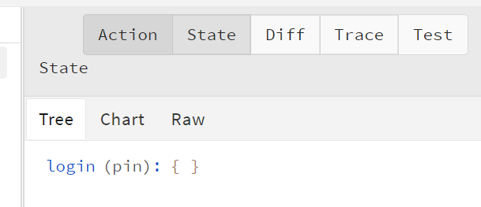

# css modules

## css-modules-基本介绍

+ 在Layout组件的`index.scss`中添加样式

```css
div {
  background-color: pink;
}
```

+ 在`Login`组件中的样式也跟着发生了改变，说明组件中的样式是相互影响的。
+ 原因：在配置路由时，Layout和 Home 组件都被导入到项目中，那么组件的样式也就被导入到项目中了。如果组件之间样式名称相同，那么一个组件中的样式就会在另一个组件中也生效，从而造成组件之间样式相互覆盖的问题。
+ 结论：默认，只要导入了组件，不管组件有没有显示在页面中，组件的样式就会生效。 
+ 解决方案
  + 手动处理 （起不同的类名）   
  + `CSS IN JS` ： 以js的方式来处理css   
  + css不是一门编程语言，css没有所有的局部作用域全局作用域这样的区分

+ CSS IN JS
  + CSS IN JS：是使用 JavaScript 编写 CSS 的统称，用来解决 CSS 样式冲突、覆盖等问题 
  + [CSS IN JS](<https://github.com/MicheleBertoli/css-in-js>) 的具体实现有 50 多种，比如：CSS Modules、[styled-components](<https://www.styled-components.com/>) 等
  + 推荐使用：[CSS Modules](<https://github.com/css-modules/css-modules>) （React脚手架已集成，可直接使用）

## css modules-基本使用

+ 创建名为 `[name].module.scss` 的样式文件（React脚手架中的约定，与普通 CSS 作区分）

```js
index.module.scss
```

+ 组件中导入该样式文件（注意语法）

```js
import styles from './index.module.scss'
```

+ 通过 styles 对象访问对象中的样式名来设置样式

```js
<div className={styles.test}></div>
```

## css module的注意点

+ 类名最好使用驼峰命名，因为最终类名会生成`styles`的一个属性

```js
.tabBar {}

styles.tabBar
```

+ 如果没有使用驼峰命名，对于不合法的命名，需要使用[]语法 

```js
.tab-bar {}

styles['tab-bar']
```

+ 如果是全局的类名，应该使用`:global(.类名)`的方式，不然会把全局类名给修改掉 
+ 如果修改的组件库的样式，不希望css-modules修改类名，可以使用:global(类名)的方式   

```js
// 如果被:global包裹的样式，css modules就不会去修改这个类名了
:global {
  .ant-pagination-item-active {
    border-color: red;
    a {
      color: red;
    }
  }
}
```

## css modules-最佳实践

- 每个组件的根节点使用 CSSModules 形式的类名（ 根元素的类名： `root` ）
- 其他所有的子节点，都使用普通的 CSS 类名 :global

```js
import styles from './index.module.scss'

const Login = () => {
  return (
  	<div className={styles.root}>
    	<h1 className="title">
      	<span className="text">登录</span>  
      	<span>登录</span>  
      </h1>
			<form className="login-form"></form>
    </div>
  )
}

// index.module.scss
.root {
  display: 'block';
  position: 'absolute';
  // 此处，使用 global 包裹其他子节点的类名。此时，这些类名就是全局的，在 JSX 中使用时，就可以用字符串形式的类名
  // 如果不加 :global ，所有类目就必须添加 styles.title 才可以
  :global {
    .title {
      .text {
        color: red;
      }
      
      span {
        font-size: 20px;
      }
    }
    .login-form { ... }
  }
}
```


# 极客园H5项目【登录模块】 

## 基本结构

**目标**：能够手动搭建登录界面的基本结构
**步骤**：

1. 完成导航栏和登录标题 - [NavBar 组件](https://mobile.ant.design/zh/components/nav-bar)
2. 添加登录表单 - [Form 组件](https://mobile.ant.design/zh/components/form)

**核心代码**：

login/index.tsx 中：

```tsx
import styles from './index.module.scss'
import { NavBar, Form, Input, List, Button } from 'antd-mobile'
import { useHistory } from 'react-router'
export default function Login() {
  const history = useHistory()
  return (
    <div className={styles.root}>
      <NavBar onBack={() => history.go(-1)}></NavBar>

      {/* 表单 */}
      <div className="login-form">
        <h2 className="title">账号登录</h2>

        <Form>
          <Form.Item className="login-item">
            <Input placeholder="请输入用户名"></Input>
          </Form.Item>
          <List.Item
            className="login-code-extra"
            extra={<span className="code-extra">发送验证码</span>}
          >
            <Form.Item className="login-item">
              <Input placeholder="请输入验证码"></Input>
            </Form.Item>
          </List.Item>
          <Form.Item>
            <Button color="primary" block className="login-submit">
              登录
            </Button>
          </Form.Item>
        </Form>
      </div>
    </div>
  )
}

```

login/index.module.scss 中：

```scss
// 导入 1px 边框的样式文件
@import '@scss/hairline.scss';

.root {
  :global {
    .login-form {
      padding: 0 33px;
      .title {
        margin: 54px 0 13px 0;
      }

      .adm-list {
        --align-items: end !important;
      }
      .adm-list-default {
        border: none;
      }
      .adm-list-item {
        padding: 0;
      }
      .adm-form {
          --border-inner: none;
          --border-top: none;
          --border-bottom: none;
        }
      .login-item {
        // 注意：因为 1px 边框样式使用了决定定位，所以，此处需要将设置为相对定位
        position: relative;
        // 为该元素设置 1px 边框
        @include hairline(bottom, #f0f0f0);

        > .adm-list-item-content {
          height: 70px;
        }
      }
      .adm-list-item-content {
        position: relative;
        border-bottom: none;
      }
      // 验证码
      .login-code-extra {
        > .adm-list-item-content {
          align-items: center;
          padding: 0;
        }
        .adm-list-item-content-extra {
          position: absolute;
          right: 0;
          bottom: 16px;
        }
      }
      .adm-input-wrapper {
        --placeholder-color: #a5a6ab;
      }
      .code-extra {
        color: #595769;
        font-size: 14px;

        &-disabled {
          color: #a5a6ab;
        }
      }
      .adm-list-item-description {
        position: absolute;
        bottom: -25px;
      }

      .login-submit {
        height: 50px;
        margin-top: 38px;
        border: none;
        font-size: 16px;
        background: linear-gradient(315deg, #fe4f4f, #fc6627);
      }
    }
  }
}
```

## 表单校验

**目标**：能够为登录表单添加校验

**核心代码**：

login/index.tsx 中：

```tsx
{/* 失去焦点的时候以及改变的时候触发校验 */}
<Form validateTrigger={['onChange', 'onBlur']}>
  <Form.Item
    className="login-item"
    name="mobile"
    rules={[
      {
        required: true,
        message: '手机号不能为空',
      },
      {
        pattern: /^1[3-9]\d{9}$/,
        message: '手机号格式错误',
      },
    ]}
  >
    {/* 关闭历史记录 */}
    <Input placeholder="请输入手机号" autoComplete="off"></Input>
  </Form.Item>
  <List.Item
    className="login-code-extra"
    extra={<span className="code-extra">发送验证码</span>}
  >
    <Form.Item
      className="login-item"
      name="code"
      rules={[
        {
          required: true,
          message: '验证码不能为空',
        },
        {
          pattern: /^\d{6}$/,
          message: '验证码格式错误',
        },
      ]}
    >
      <Input autoComplete="off" placeholder="请输入验证码"></Input>
    </Form.Item>
  </List.Item>
  <Form.Item>
    <Button color="primary" block className="login-submit">
      登录
    </Button>
  </Form.Item>
</Form>
```

## 获取登录表单数据

**目标**：能够拿到手机号和验证码数据
**步骤**：

1. 为 Form 表单添加 `onFinish`
2. 创建 onFinish 函数，作为 Form 属性 `onFinish` 的值
3. 指定函数 onFinish 的参数类型
4. 通过参数获取到表单数据

**核心代码**：

login/index.tsx 中：

```tsx
const Login = () => {
  const onFinish = (values) => {
    console.log(values)
  }

  return (
    <Form onFinish={onFinish}></Form>
  )
}
```

## axios封装

- 安装axios

```js
yarn add axios
```

- 新建文件`utils/request.ts`

```ts
// 封装axios
import axios from 'axios'

const instance = axios.create({
  baseURL: 'http://geek.itheima.net/v1_0/',
  timeout: 5000
})

// 添加请求拦截器
instance.interceptors.request.use(
  function (config) {
    // 在发送请求之前做些什么
    return config
  },
  function (error) {
    // 对请求错误做些什么
    return Promise.reject(error)
  }
)

// 添加响应拦截器
instance.interceptors.response.use(
  function (response) {
    // 对响应数据做点什么
    return response
  },
  function (error) {
    // 对响应错误做点什么
    return Promise.reject(error)
  }
)

export default instance
```

## redux初始化

**目标：**能够初始化redux

**步骤**：

1. 安装 redux 相关的包：

2. 在 store 目录中分别创建：actions 和 reducers 文件夹、index.ts 文件
3. 在 store/index.ts 中，创建 store 并导出
4. 创建 reducers/index.ts 文件，创建 rootReducer 并导出
5. 创建 reducers/login.ts 文件，创建基础 login reducer 并导出
6. 在 src/index.tsx 中为 React 组件接入 Redux

**核心代码：**

+ 安装依赖包

```tsx
yarn add redux react-redux redux-thunk redux-devtools-extension
```

+ store/index.ts

```ts
import { applyMiddleware, createStore } from 'redux'
import { composeWithDevTools } from 'redux-devtools-extension'
import thunk from 'redux-thunk'

import reducers from './reducers'

const store = createStore(reducers, composeWithDevTools(applyMiddleware(thunk)))

export default store

```

store/reducers/index.ts 中：

```ts
import { combineReducers } from 'redux'

import login from './login'

const rootReducer = combineReducers({
  login
})

export default rootReducer
```

store/reducers/login.ts 中：

```ts
const initialState = {}

const login = (state = initialState, action: any) => {
  return state
}

export default login
```

src/index.tsx 中：

```tsx
import ReactDOM from 'react-dom'
import './index.scss'
import App from './App'
import { Provider } from 'react-redux'
import store from './store'

ReactDOM.render(
  <Provider store={store}>
    <App />
  </Provider>,
  document.getElementById('root')
)

```

+ 控制台查看效果



## 配置Redux的相关类型

**目标**：能够配置Redux的基础类型
**步骤**：

1. 在 types 目录中创建两个类型声明文件：`store.d.ts` 和 `data.d.ts`

  - store.d.ts：用来存放跟 Redux 相关类型，比如，action 的类型等
  - data.d.ts：用来存放跟数据接口相关类型

2. 在 store.d.ts 中添加 Redux 相关类型

**核心代码**：

types/store.d.ts 中：

```ts
// 存放和redux相关的所有类型
// RootState
// RootAction
// RootThunkAction
// 各个模块的Action

import store from '@/store'
import { ThunkAction } from 'redux-thunk'

// store的state的类型
export type RootState = ReturnType<typeof store.getState>
// 所有的Action的类型
export type RootAction = LoginAction
// thunkAction类型

export type RootThunkAction = ThunkAction<void, RootState, unknown, RootAction>

// 各个默认的Action
export type LoginAction = {
  type: 'login/login'
}

```

types/data.d.ts

```tsx
// 存放各种通用的数据
export type LoginForm = { mobile: string; code: string }

```


## 登录-发送请求

**目标**：能够在Redux中实现登录逻辑
**步骤**：

1. 在 store/actions 中创建 login.ts 文件
2. 创建 login 函数并导出
3. 在函数中根据接口发送请求实现登录功能

**核心代码**：

store/actions/login.ts 中：

```ts
export function login(values: LoginForm): RootThunkAction {
  return async (dispatch) => {
    const res = await request.post('/authorizations', values)
    console.log(res)
  }
}

```

pages/Login/index.tsx中

```tsx
const Login = () => {
  const dispatch = useDispatch()
  const onFinish = (values: LoginForm) => {
    dispatch(login(values))
  }
}
```

## 登录-处理axios的响应的类型

在types/data.d.ts

```tsx
// 统一的axios的响应类型
export type ApiResponse<T> = {
  message: string
  data: T
}

export type Token = {
  token: string
  refresh_token: string
}

```

修改actions/login.ts

```tsx
import { ApiResponse, LoginForm, Token } from '@/types/data'

export function login(values: LoginForm): RootThunkAction {
  return async (dispatch) => {
    const res = await request.post<ApiResponse<Token>>(
      '/authorizations',
      values
    )
  }
}
```


## 登录-处理Action

+ types/store.d.ts中

```ts
import { Token } from './data'
// 登录相关的 action 类型
export type LoginAction = {
  type: 'login/login'
  payload: Token
}

```

+ store/actions/login.ts中

```ts
export function login(values: LoginForm): RootThunkAction {
  return async (dispatch) => {
    const res = await request.post<ApiResponse<Token>>(
      '/authorizations',
      values
    )
    dispatch({
      type: 'login/login',
      payload: res.data.data
    })
  }
}
```

+ store/reducers/login.ts中

```ts
import { Token } from '@/types/data'
import { LoginAction } from '@/types/store'

const initialState: Token = {} as Token

const login = (state = initialState, action: LoginAction): Token => {
  if (action.type === 'login/login') {
    return action.payload
  }
  return state
}

export default login

```

## 存储token的工具函数封装

**目标：**能够封装token的存储相关的操作

**内容：**

```jsx
import { Token } from '@/types/data'

// 本地存储的封装
const TOKEN_KEY = 'geek-h5-sh92-token'

/**
 * 保存token
 * @param token
 */
export function setToken(token: Token): void {
  localStorage.setItem(TOKEN_KEY, JSON.stringify(token))
}

/**
 * 获取token
 * @returns
 */
export function getToken(): Token {
  return JSON.parse(localStorage.getItem(TOKEN_KEY) || '{}')
}

/**
 * 删除token
 */
export function removeToken(): void {
  localStorage.removeItem(TOKEN_KEY)
}

/**
 * 判断是否有token
 * @returns
 */
export function hasToken(): boolean {
  return !!getToken().token
}

```

+ 持久化token

```ts
export const login = (values: LoginForm): RootThunkAction => {
  return async (dispatch) => {
    const res = await request.post<ApiResponse<Token>>(
      '/authorizations',
      values
    )
    // 存储到redux中
    dispatch({
      type: 'login/login',
      payload: res.data.data,
    })
    // 存储到localStorage中
    setToken(res.data.data)
  }
}
```

+ 刷新时从localStorage中获取

```ts
// 初始的token从localStorage中获取
const initialState: Token = getToken()
```


## 登录-登录成功的处理

**目标**：能够调用登录逻辑实现登录并跳转到首页

**步骤**：

1. 登录成功后，展示成功提示
2. 跳转到首页

**核心代码**：

pages/Login/index.tsx 中：

```tsx
const onFinish = async (values: LoginForm) => {
  try {
    await dispatch(login(values))
    Toast.show({
      content: '登录成功',
      icon: 'success',
    })
    // 跳转到首页
    history.push('/home')
  } catch {
    Toast.show({
      content: '登录失败',
      icon: 'fail',
    })
  }
}
```

## 错误统一处理

```tsx
// 添加响应拦截器
instance.interceptors.response.use(
  function (response) {
    // 对响应数据做点什么
    return response
  },
  function (error: AxiosError<{ message: string }>) {
    if (!error.response) {
      // 由于网络繁忙导致的
      Toast.show('网络繁忙，稍后再试')
    } else {
      // 不是网络繁忙
      Toast.show(error.response.data.message)
    }
    return Promise.reject(error)
  }
)

```

## 动态获取验证码-拿到手机号码

**目标**：能够实现点击发送验证码时获取到手机号码
**步骤**：

1. 给发送验证码绑定点击事件
2. 在点击事件中获取到文本框的值
3. 判断文本框的值是否为空
4. 如果为空或手机号格式错误时，让文本框自动获得焦点

**核心代码**：

pages/Login/index.tsx 中：

1. 注册点击事件

```jsx
<List.Item
  className="login-code-extra"
  extra={
    <span className="code-extra" onClick={onGetCode}>
      发送验证码
    </span>
  }
>
```

2. 如果为空或者手机号格式错误时，让文本框自动获得焦点

```tsx
import { useRef } from 'react'
import { InputRef } from 'antd-mobile/es/components/input'

const Login = () => {
  // 获取验证码
    const onGetCode = () => {
      const current = formRef.current!
      const mobile = current.getFieldValue('mobile')
      const errors = current.getFieldError('mobile')
      if (!mobile || errors.length > 0) {
        // 让手机号自动获取焦点
        mobileRef.current!.focus()
        return
      }
      console.log('发送请求获取验证')
    }

  return (
    // ...
    <Input placeholder="请输入手机号" maxLength={11} ref={mobileRef} />
    // ...
    <List.Item
      className="login-code-extra"
      extra={<span className="code-extra" onClick={onGetCode}>发送验证码</span>}
    >
    </List.Item>
    // ...
  )
}
```

## 动态获取验证码-发送请求

**目标**：能够使用redux发送请求获取验证码
**步骤**：

1. 在 Login 组件中导入获取验证码的 action
2. 在获取验证码事件中分发获取验证码的 action
3. 在 login action 中创建获取验证码的 action 并导出
4. 发送请求获取验证码

**核心代码**：

pages/Login/index.tsx 中：

```tsx
import { getCode, login } from '@/store/actions'

const onGetCode = () => {
  // ...

  dispatch(getCode(mobile))
}
```

actions/login.ts 中：

```ts
// 获取验证码
export const getCode = (mobile: string) => {
  return async () => {
    await request.get(`/sms/codes/${mobile}`)
    // 注意：验证码是发送到手机上的，因此，不需要更新Redux状态
  }
}
```

## hooks的函数特性

**目标**：能够理解hooks的函数特性
**内容**：

对于 React 的函数组件来说，只要修改状态，组件就会更新。同时，函数中的代码都会从头到尾重新执行一遍。
每一次的组件更新，都是一次全新的函数调用，在这一次的调用中都会创建新的：

1. 变量，比如：存储状态的变量 count
2. 函数，比如：事件处理程序 handleClick

此处，我们重点来关注下*状态变量的值*，因为我们需要在接下来的操作中拿到状态的值。

需要特殊说明的是：当一个*函数内部访问了外部的状态变量时*（比如，handleClick 访问了外部变量 count），由于 **JS 函数闭包机制**的存在，这个**函数内部只能访问到本次组件更新时创建的变量值**。比如：

组件第一次执行（第一次创建的闭包）：

```tsx
变量 count 的值为：0
函数 handleClick 访问到的外部变量 count 的值就是：0
```

点击 +1 按钮，组件重新渲染，组件第二次执行（第二次创建的闭包）：

```tsx
变量 count 的值为：1
函数 handleClick 访问到的外部变量 count 的值就是：1
```

怎么理解这个过程呢？
**可以把组件的每次更新想象成给组件拍照，组件每次更新都会对应到一张照片，而每一张特定的照片都记录了那一刻组件特定的状态。**

比如：

```tsx
1. 第一张照片（组件第一次执行）中 count 的值为：0
2. 第二张照片（组件更新会后，第二次执行）中 count 的值为：1
```

从原理层面来看，每一张照片实际上就是每次调用组件函数时创建的闭包。

```tsx
const Counter = () => {
  const [count, setCount] = useState(0)

  // 直接获取状态的值
  console.log(count)

  const handleClick = () => {
    setCount(count + 1)
  }

  return (
    <div>
      <button onClick={handleClick}>+1</button>
      <h1>计数器：{count}</h1>
    </div>
  )
}
```

**总结**：

1. 函数组件状态更新时，组件中的代码会重新执行吗？
2. 组件两次更新中的 handleClick 是同一个函数吗？

## 定时器与hooks

**目标**：能够使用hooks的函数特性分析出定时器打印的结果
**内容**：

```tsx
// 问题：定时器打印的 count 值为多少？
// 
// 操作过程如下：
// 1 先点击【延迟获取 count 值】按钮
// 2 立即点击【+1】按钮 3 次
const Counter = () => {
  const [count, setCount] = useState(0)

  console.log(count)

  const handleClick = () => {
    setCount(count + 1)
  }

  const getCount = () => {
    setTimeout(() => {
      console.log(count)
    }, 3000)
  }

  return (
    <div>
      <button onClick={handleClick}>+1</button>
      <button onClick={getCount}>延迟获取 count 值</button>
      <h1>计数器：{count}</h1>
    </div>
  )
}
```

分析该问题的出发点：点击【延迟获取 count 值】按钮时，组件是第几次更新？

## 突破闭包限制

方式1：使用全局变量

```ts
import React, { useEffect, useState } from 'react'

let total = 0
export default function Demo() {
  const [count, setCount] = useState(0)
  useEffect(() => {
    // 一旦count的值变化了，把count的值存储到total中
    total = count
  }, [count])
  const getCount = () => {
    setTimeout(() => {
      console.log('count', count)
      console.log('total', total)
    }, 3000)
  }
  return (
    <div>
      <h3>demo组件</h3>
      <div>点击次数: {count}</div>
      <button onClick={() => setCount(count + 1)}>加1</button>
      <button onClick={getCount}>获取值</button>
    </div>
  )
}
```

缺陷：如果这是一个通用组件，这个组件需要多次渲染，那么多次渲染的组件是相互影响，导致组件失去了封闭性。

方式2：使用`useRef`的高级用法

> useRef的特性：在更新期间，useRef是的不变的。
>
> useRef的语法：useRef会返回一个对象，这个对象永远不会发生变化，但是这个对象的current属性可以变化。

```ts
const [count, setCount] = useState(0)
const countRef = useRef(count)
useEffect(() => {
  // 把count的值存储到了Ref上
  countRef.current = count
}, [count])

const getCount = () => {
  setTimeout(() => {
    console.log('count', count)
    console.log('countRef', countRef.current)
  }, 3000)
}
```

方式3：使用函数形式的set函数

```ts
setCount(function(state) {
  return state + 1
})
```


## 验证码倒计时-开启倒计时

**目标**：能够在点击获取验证码时显示倒计时
**分析说明**：
**步骤**：

1. 创建状态 timeLeft 倒计时数据
2. 在点击获取验证码的事件处理程序中，更新倒计时时间并开启定时器
3. 在定时器中，更新状态（需要使用回调函数形式的 setTimeLeft）
4. 在开启定时器时，展示倒计时时间

**核心代码**：

pages/Login/index.tsx 中：

```tsx
import { useState } from 'react'

const Login = () => {
  const [timeLeft, settimeLeft] = useState(0)

  const onGetCode = () => {
    // ...

    settimeLeft(5)
    setInterval(() => {
      settimeLeft(timeLeft => timeLeft - 1)
    }, 1000)
  }

  return (
    // ...
    <List.Item
      extra={
        <span
          // 判断是否开启定时器，没开启绑定事件，开启后去掉事件
          onClick={timeLeft === 0 ? onGetCode : undefined}
        >
          {/* 判断是否开启定时器，没开启展示 发送验证码，开启后展示倒计时 */}
          {timeLeft === 0 ? '发送验证码' : `${timeLeft}s后重新获取`}
        </span>
      }
    >
    </List.Item>
  )
}
```

## 验证码倒计时-清理定时器

**目标**：能够在倒计时结束时清理定时器
**步骤**：

1. 通过 useRef Hook 创建一个 ref 对象，用来存储定时器 id
2. 在开启定时器时，将定时器 id 存储到 ref 对象中
3. 通过 useEffect Hook 监听倒计时的变化
4. 判断倒计时时间是否为 0 ，如果为 0 就清理定时器

```tsx
const onGetCode = async () => {
  if (time > 0) {
    return
  }
  // 获取手机号
  const mobile = form.getFieldValue('mobile')
  // 获取手机号对应的校验错误
  const error = form.getFieldError('mobile')
  if (!mobile || error.length > 0) {
    // 手机号不完整
    mobileRef.current?.focus()
    return
  }
  await dispatch(getCode(mobile))
  setTime(60)
  timerRef.current = window.setInterval(() => {
    setTime((time) => time - 1)
  }, 1000)
}

// 倒计时为0 清除定时器
useEffect(() => {
  if (time === 0) {
    // 时间到了
    clearInterval(timerRef.current)
  }
}, [time])

// 组件销毁的时候，清理定时器
useEffect(() => {
  return () => {
    clearInterval(timerRef.current)
  }
}, [])
```

